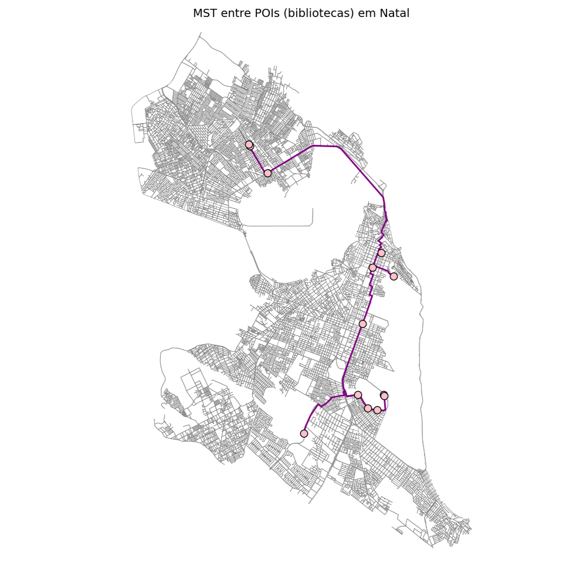

# MST entre POIs (Bibliotecas) em Natal

### Maria Eduarda Lima da Luz
### Matrícula: 20250051776


## 📖 Descrição do Projeto

Este repositório apresenta a implementação, em Python e Jupyter Notebook, da construção de uma **Árvore Geradora Mínima (MST)** entre bibliotecas municipais de Natal (RN). A MST conecta todos os pontos de interesse (POIs) com o menor custo total de distância, permitindo aplicações em planejamento urbano, logística e infraestrutura.

**Fluxo geral:**

1. Obtenção do grafo de ruas de Natal via OSMnx.
2. Conversão do grafo dirigido em MultiGraph não direcionado.
3. Coleta e tratamento de POIs (bibliotecas).
4. Mapeamento de coordenadas para nós do grafo.
5. Construção de um grafo completo de interesse entre POIs.
6. Cálculo da MST usando o algoritmo de Kruskal (NetworkX).
7. Visualização do resultado em Matplotlib.

---

## 🔗 Links Úteis

* 🎙️ Podcast sobre este projeto: [Ouça aqui](https://notebooklm.google.com/notebook/0e81e5ae-0f76-46bb-a1da-3f9dad2130a5/audio)
* 📝 Artigo no Medium: [Leia no Medium](https://medium.com/@mariaedulluz/constru%C3%A7%C3%A3o-da-%C3%A1rvore-geradora-m%C3%ADnima-das-bibliotecas-de-natal-729e1e9f9410)


---

## 📁 Estrutura do Repositório

```
├── README.md              # Documento de apresentação e instruções
├── bibliotecas_natal.py   # Script principal em Python
└── bibliotecas_natal.png  # Visualização da MST sobre o mapa de Natal
```

---

## 🚀 Como Executar

### 1. Pré-requisitos

* Python 3.7+
* Bibliotecas Python: `osmnx`, `networkx`, `matplotlib`, (instale via `pip install osmnx networkx matplotlib`)

### 2. Executar o Script

```bash
python bibliotecas_natal.py
```

Isso irá:

1. Baixar o grafo de ruas de Natal (tipo "drive").
2. Coletar coordenadas das bibliotecas (fallback para escolas).
3. Construir o grafo de interesse e aplicar o algoritmo de Kruskal para obter a MST.
4. Imprimir no terminal o comprimento total da MST (em km) e salvar ou exibir o mapa.

---

## Visualização



**Figura:** MST conectando bibliotecas municipais de Natal. Pontos em rosa representam bibliotecas, linhas roxas mostram as rotas da árvore geradora mínima.

---

